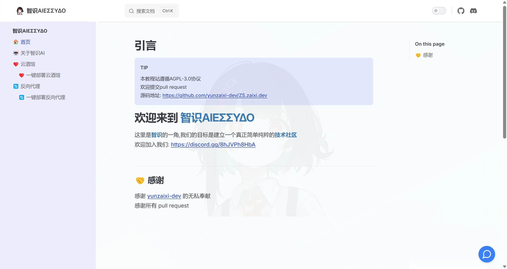
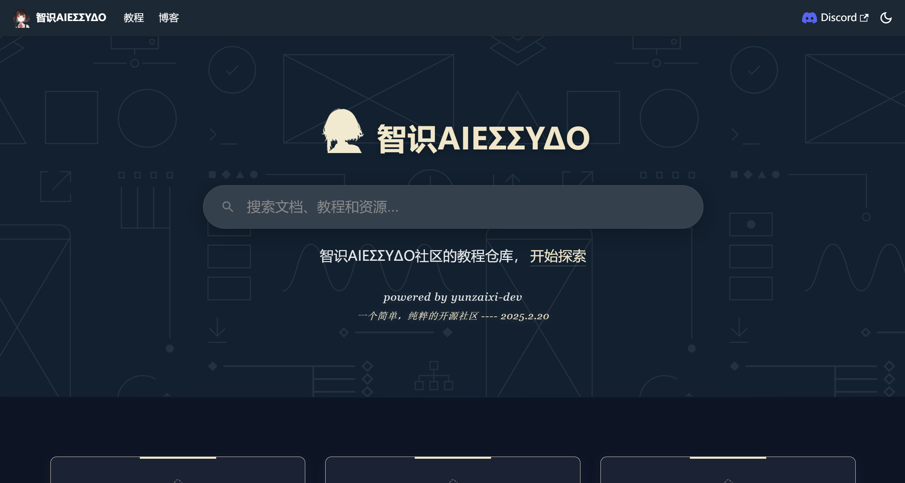

# ✨智识ΑIEΣΣΥΔΟ教程仓库

:::info
智识ΑIEΣΣΥΔΟ教程仓库目前的网址为 https://zsai.zaixi.dev
:::
**智识ΑIEΣΣΥΔΟ教程仓库** 是 **智识ΑIEΣΣΥΔΟ社区** 的 **永久核心项目** 之一，旨在促进信息平等，打破信息孤岛，让每一个人都能平等获取知识和技术。

## 1 核心原则
以下原则将指导智识ΑIEΣΣΥΔΟ教程仓库的建设和维护。
### 1.1 简洁
保持内容简洁，避免冗余和复杂，使用户能够快速找到所需信息。
### 1.2 现代化
使用现代化的工具和方法，使内容易于维护和更新，保持内容的时效性。
### 1.3 实用性优先
教程中尽量提供实用的教程，避免过于理论或抽象的内容，实践大于理论。

## 2 历史沿革
**智识ΑIEΣΣΥΔΟ教程仓库** 创建于2025年1月，目前正处于早期发展阶段

### 2.1 早期 (2025年2月20日 - 2025年3月24日)
**yunzaixi-dev** 建立了智识ΑIEΣΣΥΔΟ社区，智识ΑIEΣΣΥΔΟ教程仓库也随之建立。

### 2.2 第一次重构 (2025年3月24日 - 至今)
随着 **智识ΑIEΣΣΥΔΟ社区** 的发展，**yunzaixi-dev** 与 **夕雪** 决定重构智识ΑIEΣΣΥΔΟ教程仓库，扩展其功能以更好地服务于更多AI爱好者。

新的教程仓库更换了技术栈，大幅提升了开发效率，可拓展性，UI设计也更加现代化。
