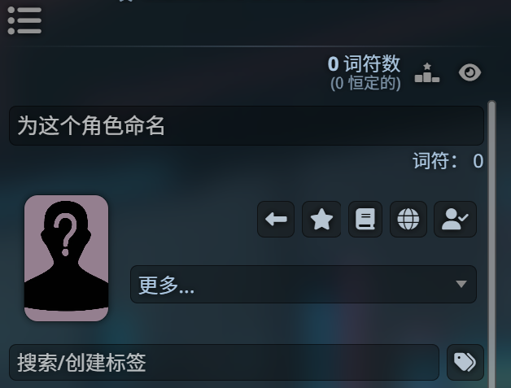

# 酒馆简介

酒馆(原名SillyTavern)是面向高级用户的LLM前端，截至至本教程发布时，酒馆已经发展成世界上最流行的AI角色扮演工具，位列OpenRouter(LLM_API提供商)排行榜榜首。

酒馆采用nodejs开发，相较于其它的LLM前端而言，具有以下优势：
1. 完全开源，几乎可以部署在任何平台上，兼容世界上绝大多数LLM_API格式
2. 高度自定义，可以实现几乎任何功能
3. 强大的角色卡与插件生态

初始安装完成的SillyTavern只是一个基本的界面，随后用户可以根据自己的喜好安装需要的软件并配置成符合自己理想的个性化前端。

# 核心概念

