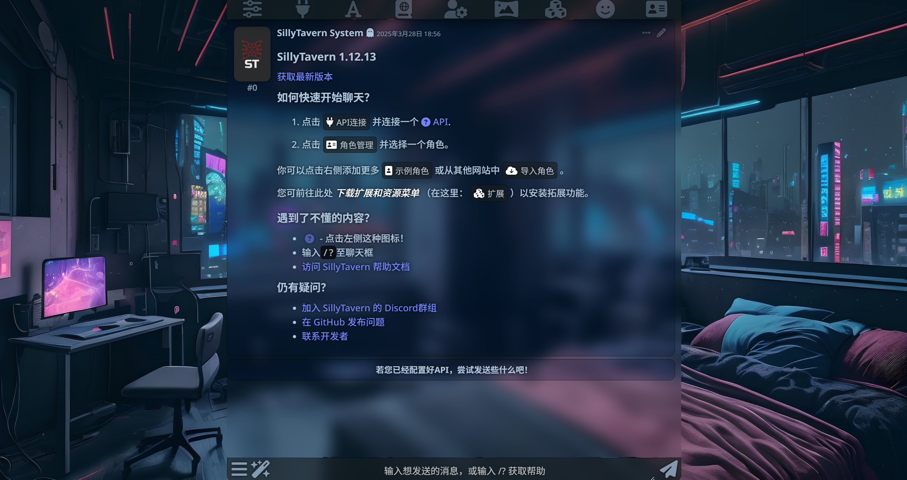
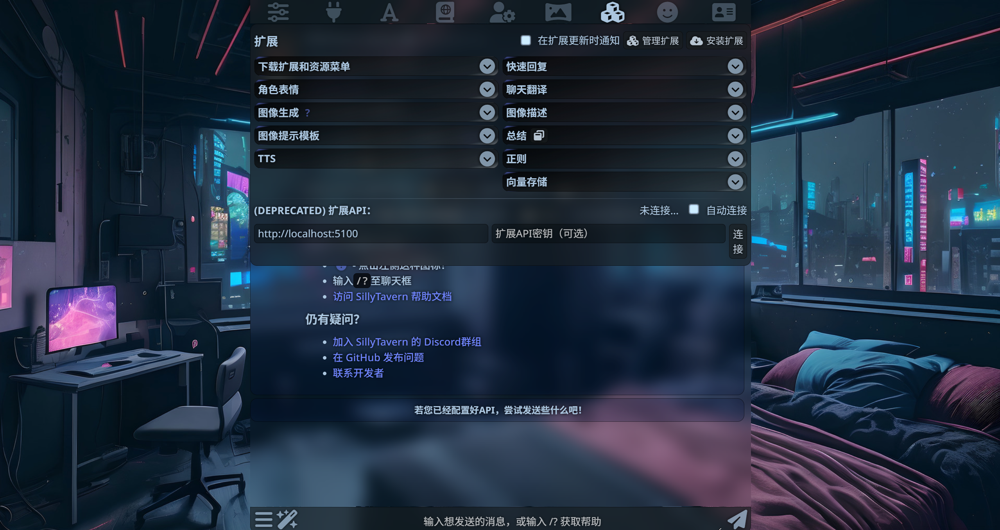
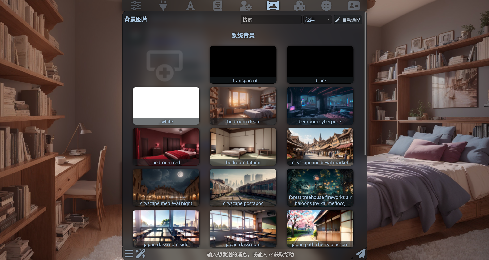

# 酒馆简介

酒馆(原名SillyTavern)是面向高级用户的LLM前端，截至本教程发布时，酒馆已经发展成世界上最流行的AI角色扮演工具，位列OpenRouter(LLM_API提供商)排行榜榜首。

酒馆采用nodejs开发，相较于其它的LLM前端而言，具有以下优势：
1. 完全开源，几乎可以部署在任何平台上，兼容世界上绝大多数LLM_API格式
2. 高度自定义，可以实现几乎任何功能
3. 强大的角色卡与插件生态

初始安装完成的SillyTavern只是一个基本的界面，随后用户可以根据自己的喜好安装需要的软件并配置成符合自己理想的个性化前端。

## 核心概念

### 角色卡系统

**角色卡(Character Card)** 是酒馆的核心功能之一，用户可以创建、导入或分享各种预设角色。每个角色卡包含:
- 角色基本信息(名称、外观描述、性格特点)
- 角色设定与背景故事
- 对话示例与互动风格指南

:::info
参考教程：[预设与角色卡](/docs/目录/前置知识区/AIGC专区/酒馆专区/预设与角色卡/预设与角色卡.md)
:::

### 模型连接方式

酒馆支持多种API连接模式:
- 本地模型(如通过Kobold AI、Oobabooga或Ollama运行的模型)
- 云端模型(OpenAI API、Claude API、Google Gemini等)

:::info
参考教程：[云端API部署指南](/docs/目录/实践教程区/AIGC专区/LLM专区/云端API部署指南/云端API部署指南.mdx)
:::

### 插件系统

酒馆拥有丰富的插件生态系统，可以扩展基础功能:
- 图像生成插件
- 记忆与上下文增强插件
- 正则替换

### 高级定制选项

用户可以精细调整多项参数:
- 上下文窗口大小与格式
- 温度、top_p、频率惩罚等生成参数
- 提示词工程与模板
- 界面外观与功能布局(壁纸)

酒馆的强大之处在于它允许用户完全控制AI交互体验，从模型选择到界面设计，都可以按照个人需求进行定制。