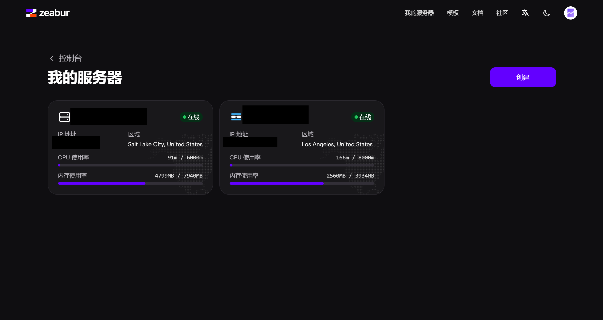
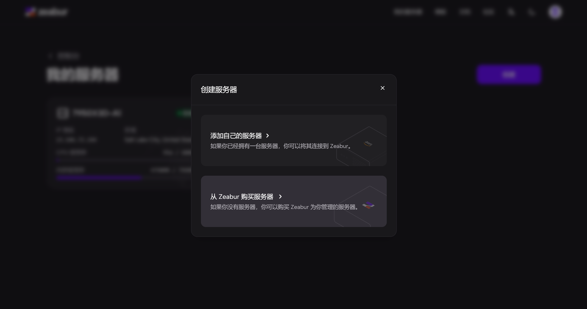
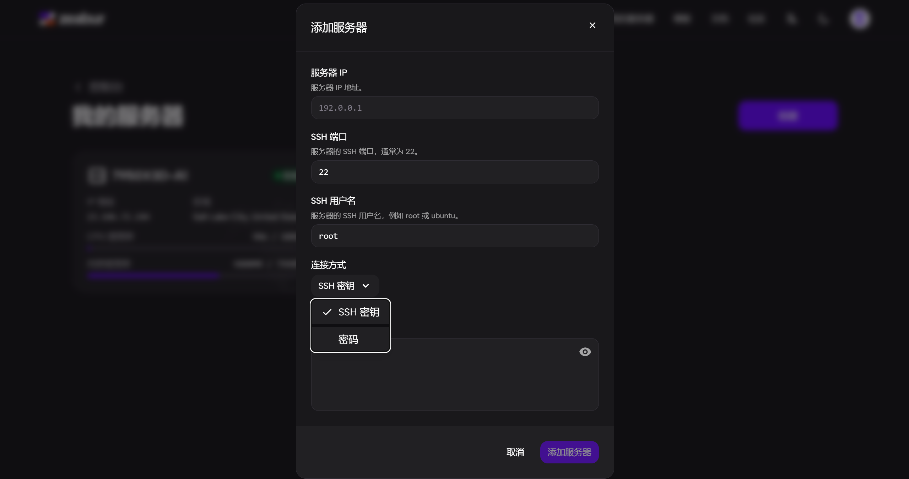

# Zeabur入门教程

Zeabur是一个现代化的云原生开发平台，可用于一键部署各种云服务，例如：
- 逆向API服务
- API轮询服务
- 云酒馆

## 1. 创建Zeabur账号
首先，访问 [Zeabur官网](https://zeabur.com/referral?referralCode=y.zzz) 并注册账号。

## 2. 准备至少一台VPS
使用Zeabur需要至少拥有一台VPS，目前VPS可以如下：
- 直接在Zeabur上购买(最简单的方式)
- 购买其它VPS然后在Zeabur上初始化，详见 [VPS购买指南](/docs/目录/前置知识区/云原生专区/VPS/VPS购买/VPS购买指南)

:::warning
购买VPS时需要考虑以下因素：
1. 至少需要2GB内存，建议使用Ubuntu
2. IP质量，物理位置，这将直接影响逆向API服务的稳定性与响应速度(必须是海外服务器)。
3. CPU核心数，CPU性能，这决定了云服务的使用体验。
:::

## 3. 初始化Zeabur项目
首先进入 [我的服务器](https://zeabur.com/servers) 界面,如图：

点击"创建"，选择"我的服务器"，假如你希望直接在Zeabur上购买服务器，则选择另一个，这里以其它VPS为例。

输入您服务器的连接信息(这一般由您的云服务商提供)

点击确认，等待服务器加载完成后，重新加载界面，可以在 [我的服务器](https://zeabur.com/servers) 界面看到您添加的服务器，如图

## 4. 完成
自此，恭喜你成功完成Zeabur部署的前期准备工作，可以开始一键部署各种云服务了。