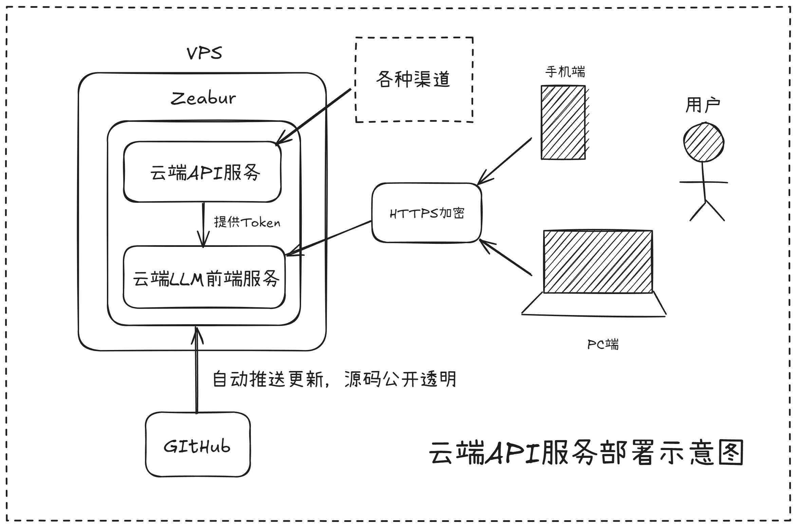
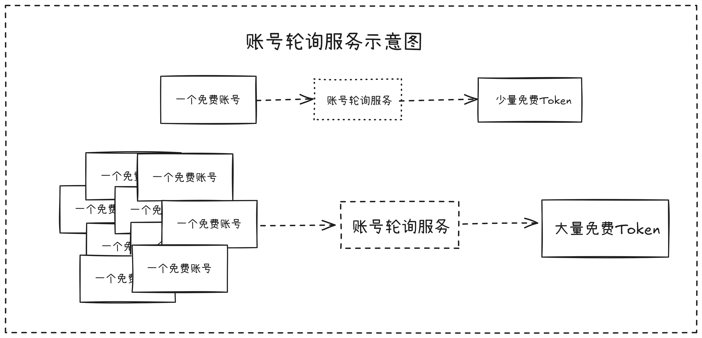
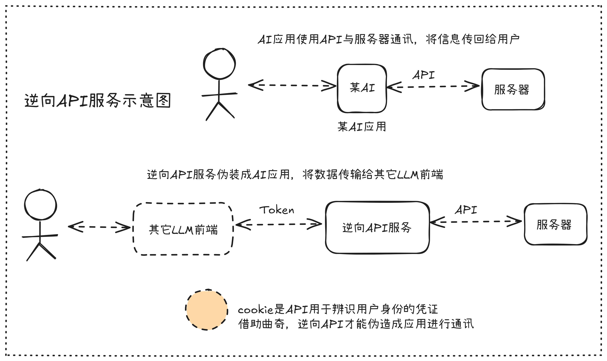

# 云端API部署指南
Token是运行一切LLM服务的基础，而云端API服务可以源源不断地为我们提供Token。

本教程收录当今世上最优雅的云端API服务部署方案。

## 1. 账号轮询服务
账号轮询服务是指将多个具有少量免费额度账号部署在轮询服务中，当一个账号使用完毕后，会自动切换到下一个账号，从而获得较大的API免费额度，实现白嫖。

## 2. 逆向API服务
逆向API服务是指将主流的LLM应用进行逆向，从而将AI订阅转换为API。

## 3. 本地API服务
本地API服务是指将主流的LLM应用部署在本地，从而产出API。

