# You逆向服务(又被称为You反代)

欢迎来到本教程，本教程将详细介绍如何将You Pro账号转换为稳定API的服务。
:::warning
请完成前置教程：
[Zeabur入门](/docs/目录/前置知识区/云原生专区/Zeabur/Zeabur入门/Zeabur入门.md)
:::

## 1. 账号cookie准备
- 你需要一个(或者多个?) [You.com](https://you.com) Pro 账号
:::tip
若您有edu邮箱，You Pro账号可以打五折。
:::
- 使用Chrome浏览器 访问 [You.com](https://you.com) 登录

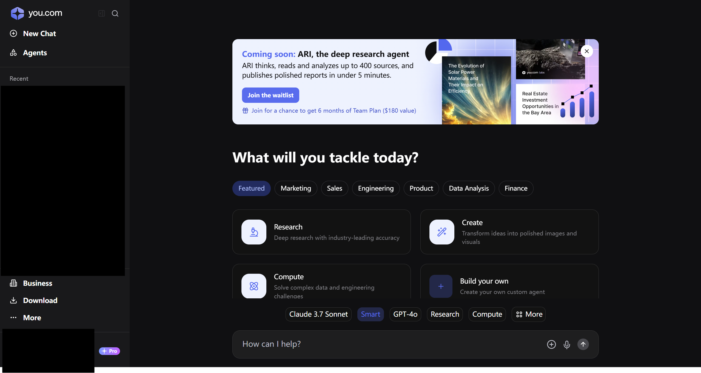

- 登录后，按F12打开开发者工具

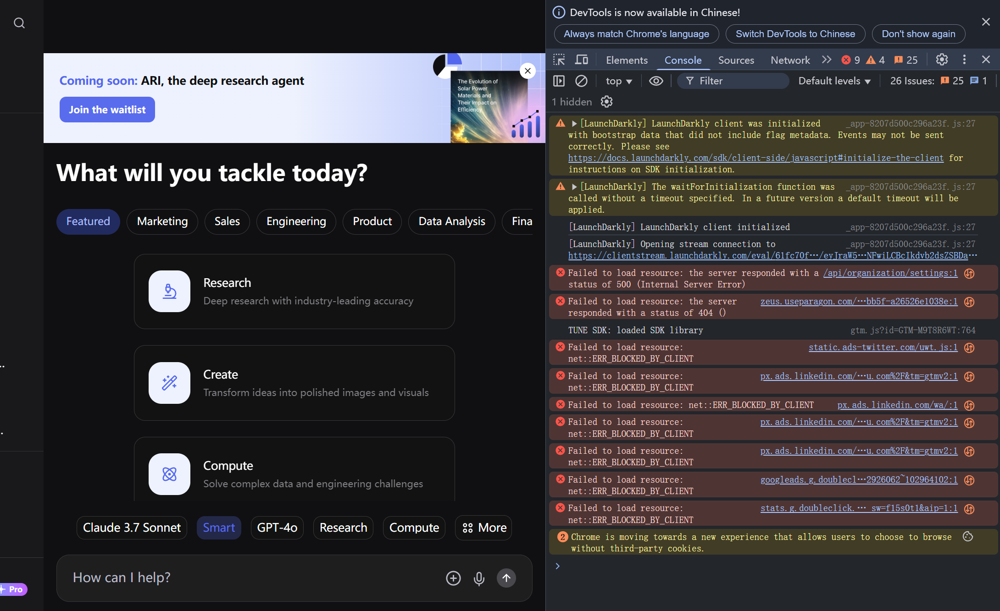

- 在开发者工具中，找到"Console"标签，输入console.log(document.cookie)，请注意不要直接粘贴，如图：

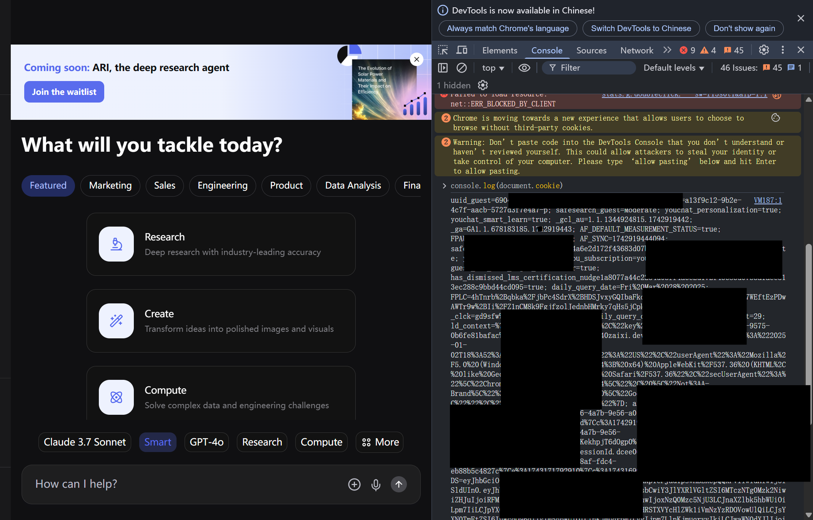

- 此时控制台会输出一长串cookie，复制它，类似以下这样：

```
uuid_guest=6904a2130-20 ...(后面一大堆)
```

- 将其复制到一个地方待用

## 2. 服务部署
1. 首先进入 [我的服务器] (https://zeabur.com/projects) 界面

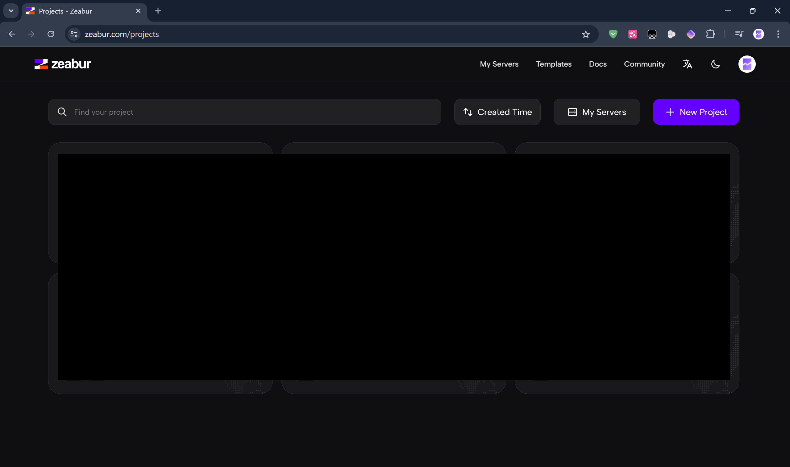

2. 新建或者进入一个项目，如图

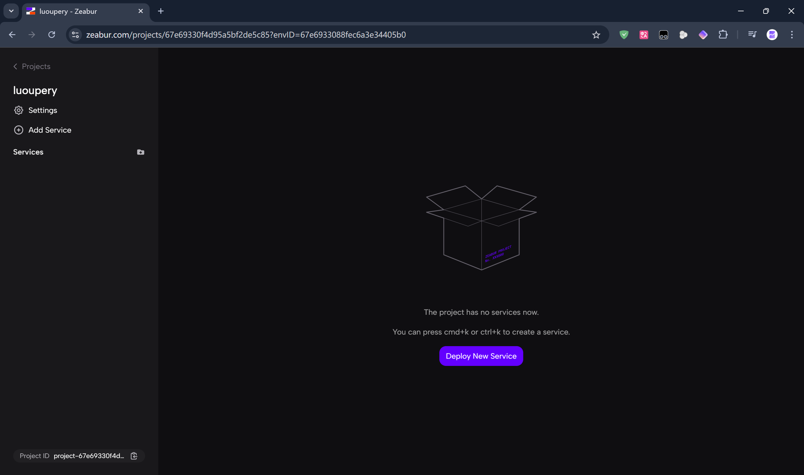

3. 搜索模板"youchat-proxy",点击部署

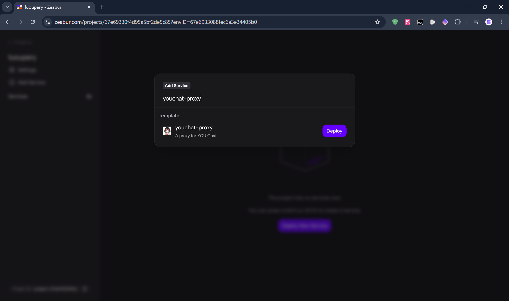

4. 点击部署，等待部署完成，然后在首页点击add domain添加域名(拉到最底部)：

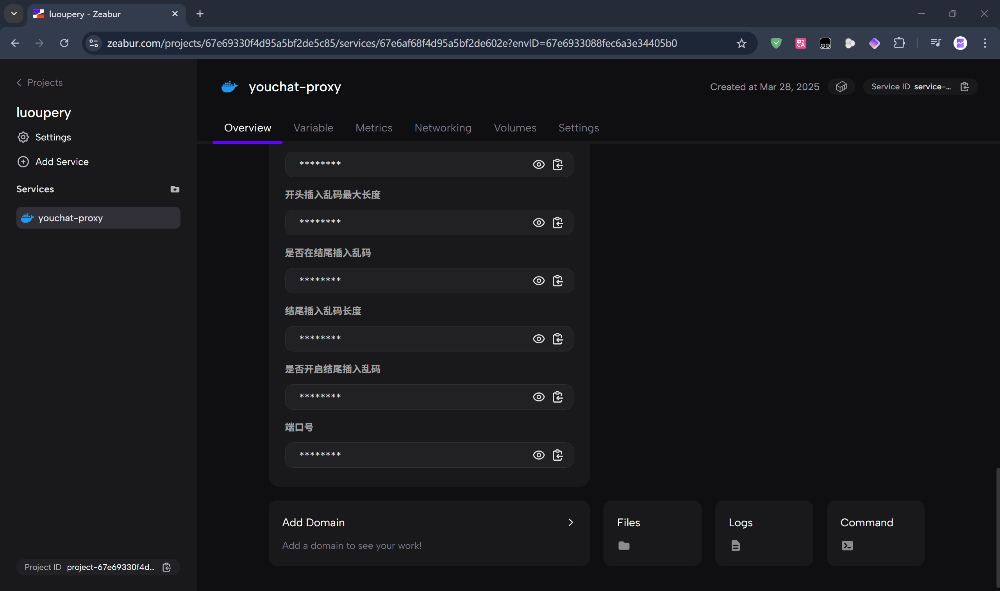

5. 域名随便填写一个

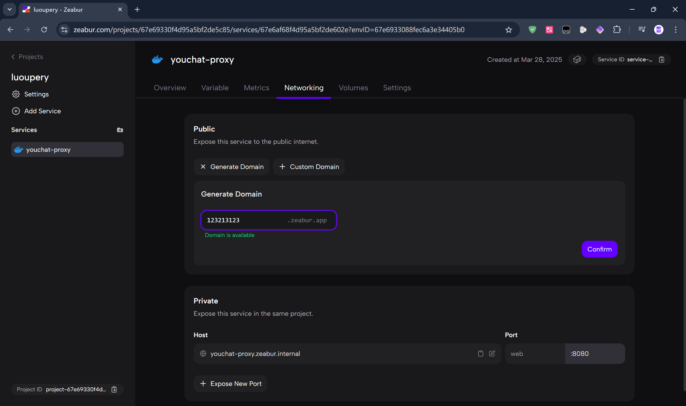

6. 进入setting界面，进入open config界面，将cookie填写到config对应位置中

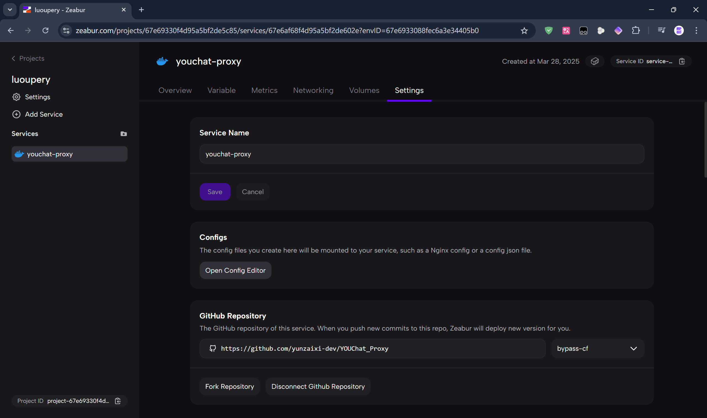

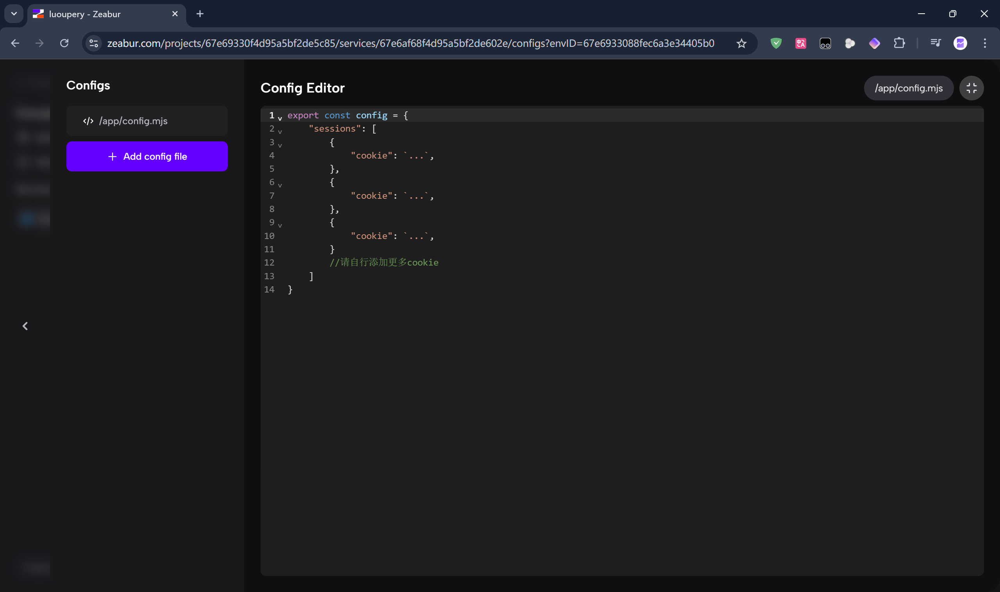

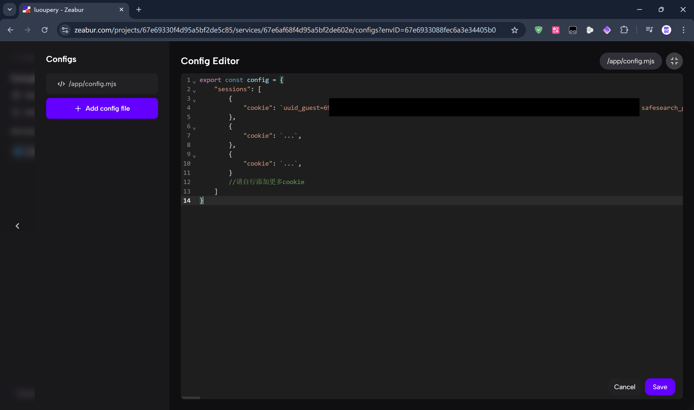

7. 点击保存配置文件，然后回到容器首页，点击restart使配置生效，重启完成后，在浏览器输入刚才设置的域名，若出现如下图所示，则为成功：

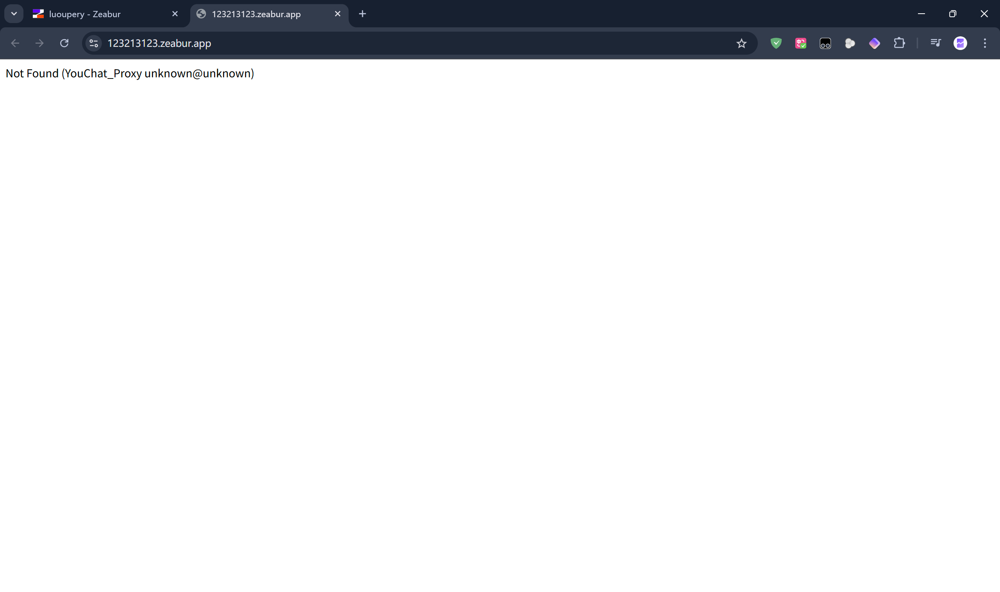

8. 查看首页的API密钥，复制

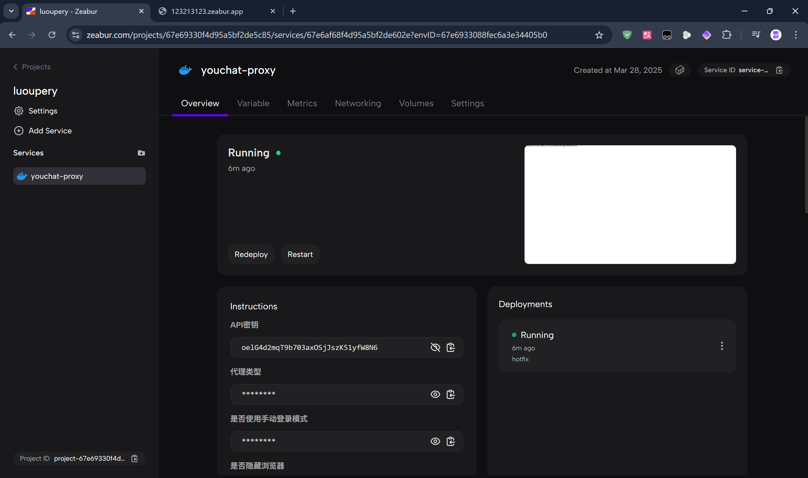

9. 进入您的酒馆API配置界面，其中红色区域输入您的域名+/v1，输入密钥。

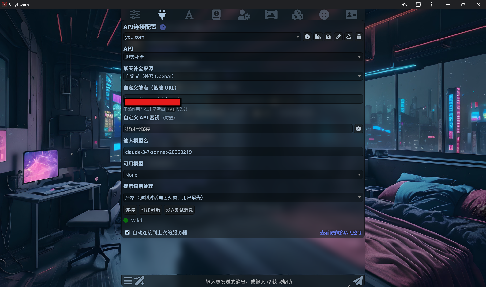

 ## 3. 完成
至此，您已经成功部署了You逆向服务并链接酒馆，可以使用了！

