# Zeabur部署云酒馆(SillyTavern)教程

import Tabs from '@theme/Tabs';
import TabItem from '@theme/TabItem';

:::tip 前言
本教程将带你使用Zeabur快速部署云端酒馆(SillyTavern)，只需简单几步，无需懂编程或服务器知识！
:::

:::warning 注意事项
在阅读本教程前，请先阅读 [Zeabur入门(点击跳转)](/docs/目录/前置知识区/云原生专区/Zeabur/Zeabur入门/Zeabur入门.md) 教程
:::

## 1. 部署流程概览

## 2. 使用部署模板

进入 [Zeabur控制台](https://zeabur.com/projects) ，如图：

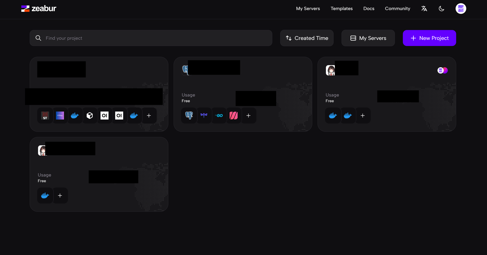

### 2. 创建新项目

1. 在Zeabur控制台首页，点击"New Project"按钮，随后如图所示：

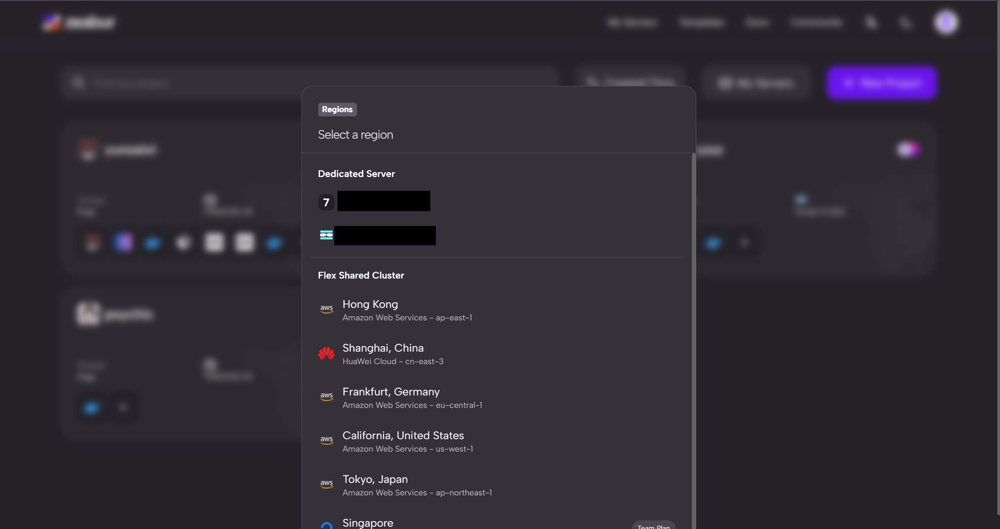

2. 选择您的一台服务器，并点击，随后如图：

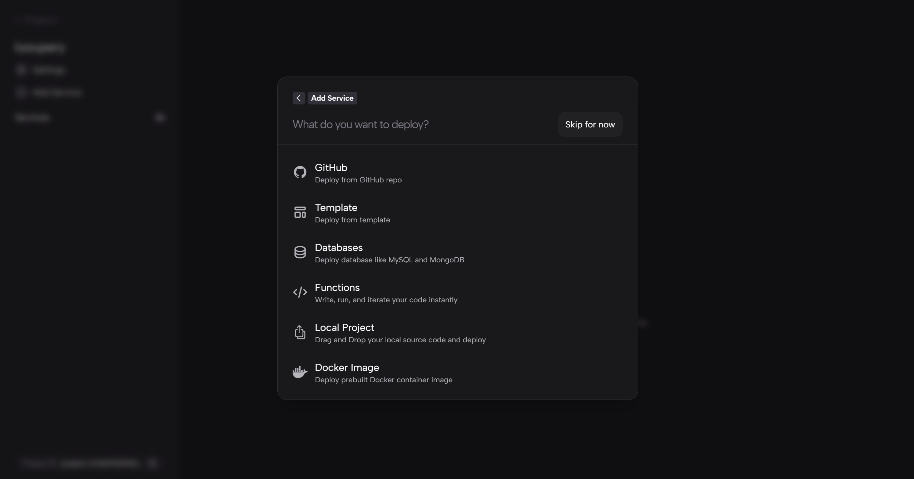

3. 在搜索框输入"zs-sillytavern",会显示出对应的模板，如图：

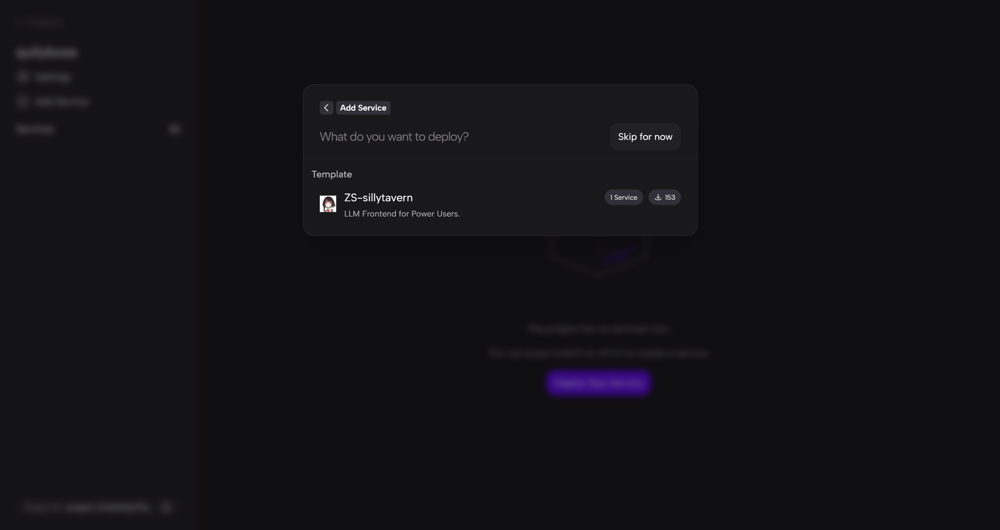

4. 点击"Deploy"按钮开始部署，如图：

5. 此时zs-sillytavern将显示在您的项目中，耐心等待部署完成：

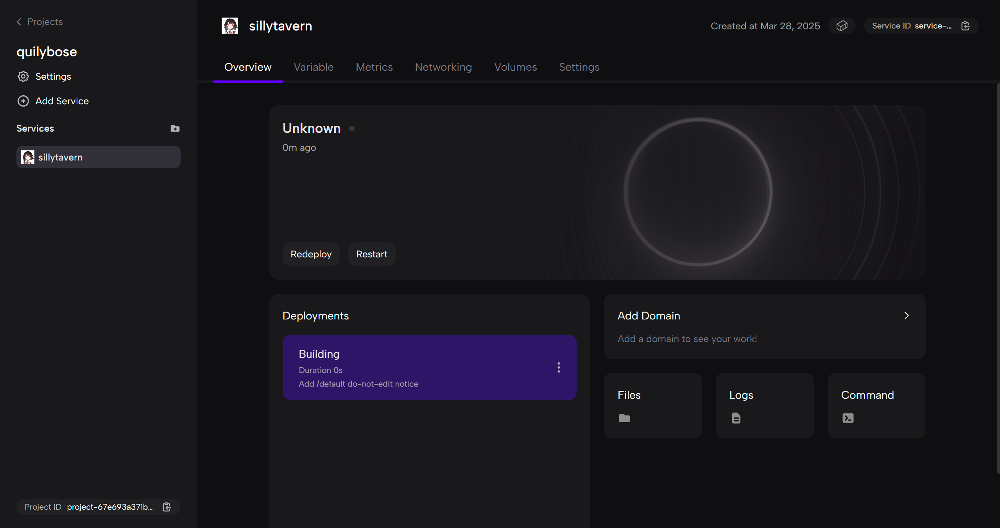

## 3. 基本信息配置

1. 点击zs-sillytavern，点击首页的add domain添加一个域名，并确认，如图(域名可以随意定义)：

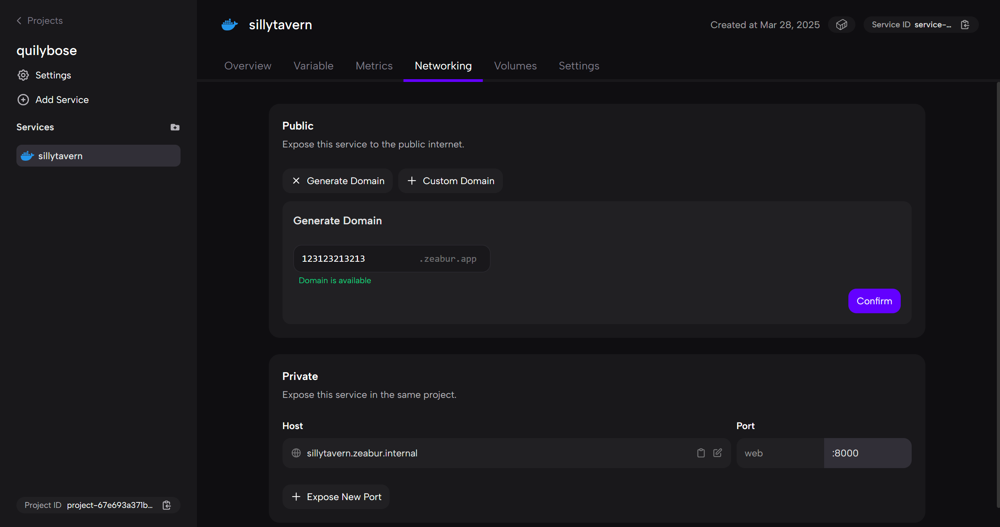

2. 点击setting栏，如图：

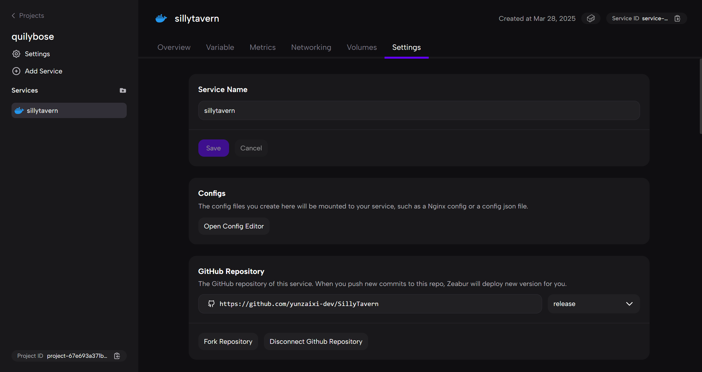

3. 点击open config，进入配置文件界面，如图：

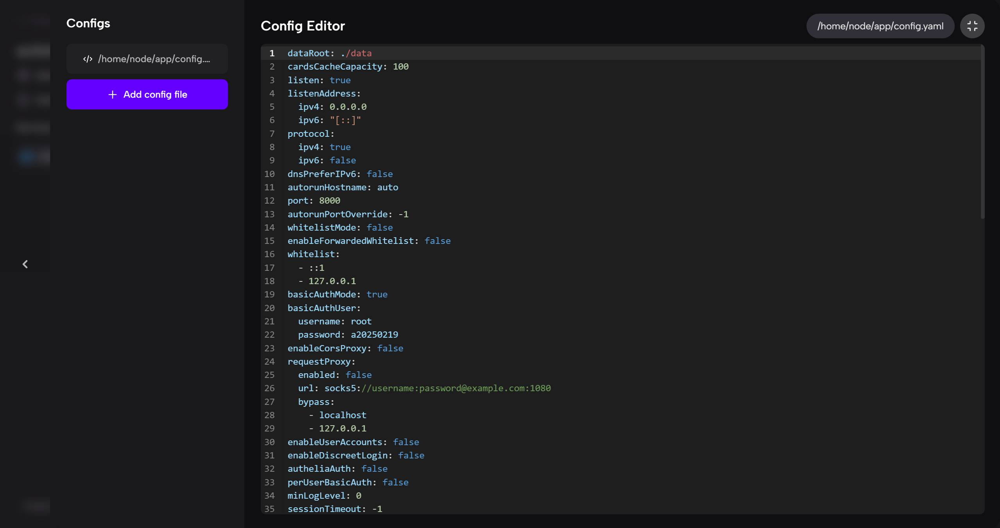

4. 修改红色区域中的账号为你自己的，如图：

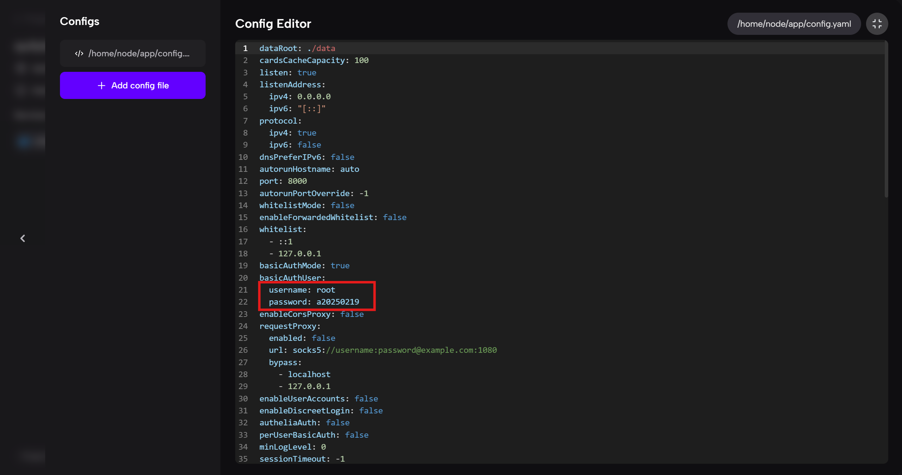

5. 回到容器首页，点击重启使配置生效

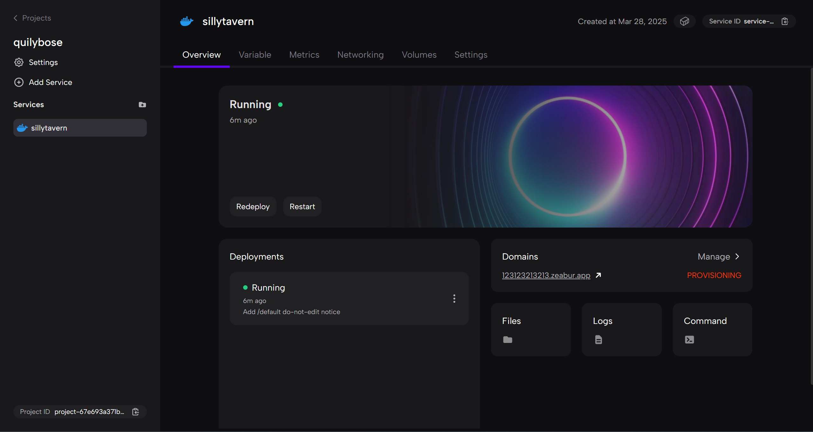

## 4. 访问云酒馆

1. 点击首页的domain，输入密码，即可使用云酒馆(可以在任意设备访问！)，如图：

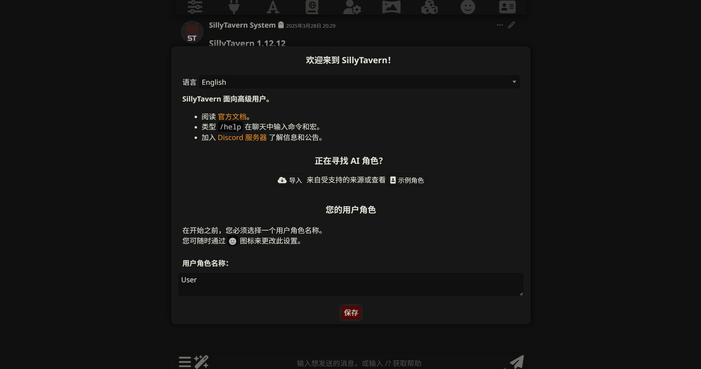

## 总结

通过本教程，您已经成功使用Zeabur部署了云端酒馆(SillyTavern)。现在您可以从任何设备访问您的AI角色扮演平台，享受云端部署带来的便利。

后续您可以：
1. 导入或创建角色卡
2. 配置API连接（OpenAI、Claude等）
3. 调整生成参数
4. 安装扩展插件增强功能

祝您在云酒馆中玩得愉快！